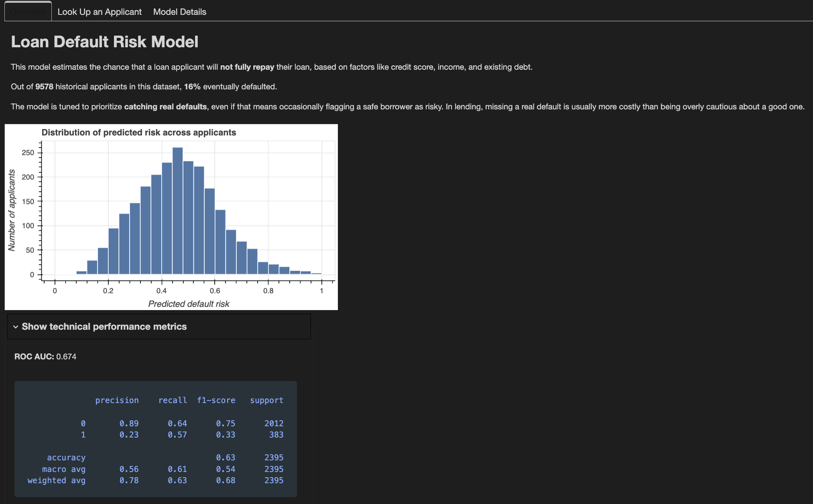
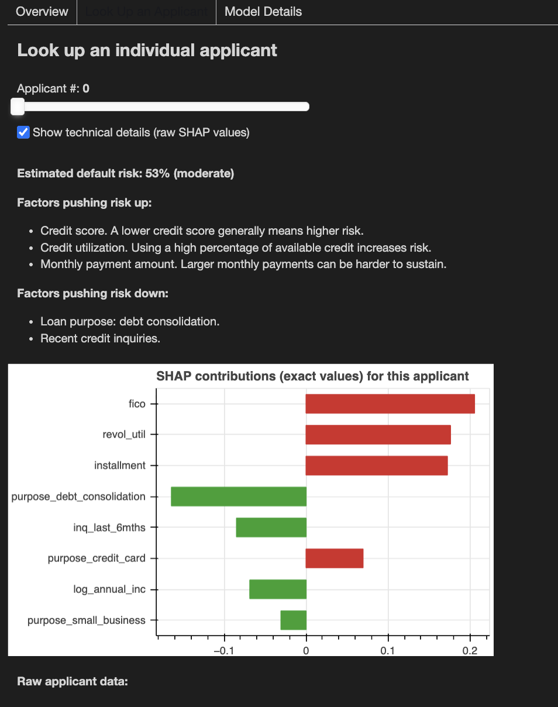
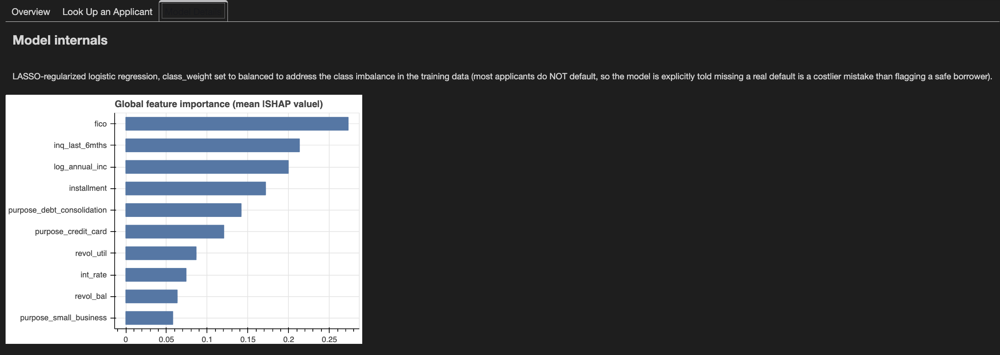

# Loan Default Risk Prediction

### Overview Dashboard



---

### Look Up an Applicant



---

### Model Details



---

## Overview

This repository extends an open-source loan default classification project
with a regularized, interpretable model and an interactive dashboard for
exploring individual credit risk predictions.

Forked from [jianninapinto/Loan-Default-Risk-Prediction](https://github.com/jianninapinto/Loan-Default-Risk-Prediction),
which established the base dataset wrangling, exploratory data analysis,
and baseline Logistic Regression / Random Forest / XGBoost models with
SHAP and permutation importance.

**What this fork adds:**

- A LASSO-regularized logistic regression model, explicitly re-weighted
  (`class_weight='balanced'`) to correct for severe class imbalance in
  the training data
- Per-applicant SHAP explainability, framed around adverse action notice
  requirements under the Equal Credit Opportunity Act (ECOA) — real
  lenders are legally required to give applicants specific reasons for a
  credit denial, and SHAP values are well suited to exactly that
- A misclassification breakdown comparing false positive and false
  negative applicant profiles, in the same structure used in a separate
  research project on prescription opioid risk misclassification
- An interactive Panel/Bokeh dashboard with three layers of depth: a
  plain-language overview for a general audience, a per-applicant
  explorer with an optional technical drill-down, and a fully technical
  model internals view

---

## Data

~9,600 loans from [Kaggle: Loan Data](https://www.kaggle.com/datasets/itssuru/loan-data), with borrower profile, loan structure, and repayment outcome.

| Variable | Explanation |
|:---|:---|
| credit_policy | 1 if the customer meets the credit underwriting criteria; 0 otherwise. |
| purpose | The purpose of the loan. |
| int_rate | The interest rate of the loan (more risky borrowers are assigned higher interest rates). |
| installment | The monthly installments owed by the borrower if the loan is funded. |
| log_annual_inc | The natural log of the self-reported annual income of the borrower. |
| dti | The debt-to-income ratio of the borrower (amount of debt divided by annual income). |
| fico | The FICO credit score of the borrower. |
| days_with_cr_line | The number of days the borrower has had a credit line. |
| revol_bal | The borrower's revolving balance (amount unpaid at the end of the credit card billing cycle). |
| revol_util | The borrower's revolving line utilization rate (amount of credit line used relative to total available). |
| inq_last_6mths | The borrower's number of inquiries by creditors in the last 6 months. |
| delinq_2yrs | The number of times the borrower had been 30+ days past due on a payment in the past 2 years. |
| pub_rec | The borrower's number of derogatory public records. |
| not_fully_paid | 1 if the loan is not fully paid; 0 otherwise (the prediction target). |

---

## Motivation

Predicting loan default is a core function of consumer lending, but a
model's raw accuracy can be misleading. In this dataset, roughly 84% of
applicants historically repaid their loans, so a model that naively
predicts "will repay" for everyone is already 84% "accurate" while
catching almost no real defaults. This project treats that as a starting
point, not an ending point: it makes the class-imbalance tradeoff
explicit, documents the resulting precision/recall tradeoff honestly, and
builds interpretability in as a first-class feature rather than an
afterthought.

---

## Key Findings

- **Baseline model:** 84% accuracy, but only 3% recall on actual
  defaults — the model was almost entirely blind to the outcome it was
  supposed to predict.
- **After correcting for class imbalance:** recall on actual defaults
  rose to 57%, at the cost of a lower overall accuracy (63%) and more
  false alarms. Neither setting is objectively "correct" — the right
  tradeoff depends on the relative cost of a missed default versus a
  wrongly flagged safe borrower, a business decision rather than a
  purely statistical one.
- **LASSO feature selection** retained 16 of 17 candidate features, with
  loan purpose, FICO score, and recent credit inquiries carrying the
  largest coefficients.
- **SHAP analysis** found that recent credit inquiries (`inq_last_6mths`)
  dominate individual risk explanations for the highest-risk applicants
  specifically, even though it ranks second (behind FICO score) in
  average importance across all applicants — the feature that matters
  most on average is not necessarily the feature that matters most for
  the riskiest edge cases.

---

## Repository Structure

```text
.
├── images/                              # Dashboard screenshots
├── ML_Problem_Definition.ipynb          # Base repo: baseline modeling
├── Wrangle_ML_Datasets.ipynb            # Base repo: data cleaning
├── Model_Interpretation.ipynb           # Base repo: SHAP, permutation importance
├── Permutation_Boosting.ipynb           # Base repo: model tuning
├── lasso_misclassification.py           # Added: LASSO model + misclassification breakdown + SHAP reason codes
├── loan_risk_dashboard.ipynb            # Added: interactive Panel/Bokeh dashboard
├── loan_data.csv                        # Not included — see Getting Started
└── README.md
```

---

## Getting Started

1. Clone this repository.
2. Create a virtual environment and install dependencies:
   ```
   python3 -m venv venv
   source venv/bin/activate
   pip install pandas numpy scikit-learn matplotlib seaborn shap jupyter panel jupyter_bokeh
   ```
3. Download `loan_data.csv` from [kaggle.com/datasets/itssuru/loan-data](https://www.kaggle.com/datasets/itssuru/loan-data)
   (free Kaggle account required) and place it in the repository root.
4. Run the modeling pipeline:
   ```
   python3 lasso_misclassification.py
   ```
5. Launch the interactive dashboard by opening `loan_risk_dashboard.ipynb`
   and running all cells.

---

## Technologies

- Python
- pandas, NumPy, scikit-learn
- SHAP
- Panel, Bokeh
- Jupyter Notebook

---

## Acknowledgements

Base dataset wrangling, exploratory analysis, and initial modeling
(Logistic Regression, Random Forest, XGBoost with SHAP and permutation
importance) from [jianninapinto/Loan-Default-Risk-Prediction](https://github.com/jianninapinto/Loan-Default-Risk-Prediction).
Dataset originally from [Kaggle: Loan Data](https://www.kaggle.com/datasets/itssuru/loan-data).

The base repo's models were tuned via Randomized Search Cross-Validation;
this fork's LASSO model uses `LogisticRegressionCV`'s built-in
cross-validated regularization search instead.

## Authors

- [@jianninapinto](https://www.github.com/jianninapinto) — original repository: data wrangling, baseline Logistic Regression / Random Forest / XGBoost models, SHAP and permutation importance analysis
- [@aprilyxren](https://www.github.com/aprilyxren) — LASSO-regularized model, class-imbalance handling, SHAP-based reason codes, interactive Panel dashboard

## License

This project follows the license terms of the original repository.